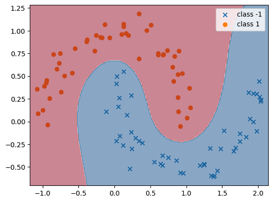
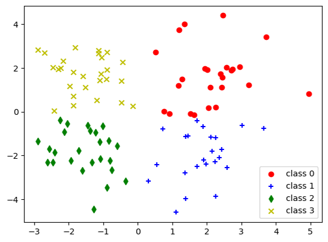

## Common ML algorithms implemented from scratch
------------------------------------------------
   

## Included algorithms:
Regression:
* Linear regression with $L_2$, $L_1$ and $L_{\infty}$ objectives

Classification:
* Logistic regression for binary classification in range $\{0,1\}$
* Binomial deviance loss + $L_2$ regularization for binary classification in range $\{-1,1\}$
* Hinge loss + $L_2$ regularization for binary classification in range $\{-1,1\}$
* SVM dual form for binary classification in range $\{-1,1\}$
* Multinomial deviance loss for multiclass classification

Clustering:
* K-means clustering

Dimensionality reduction:
* Principal component analysis (PCA)

## Tests demo:
`tests/viz.ipynb`

## Installation:
```
pip install -requirements.txt
```